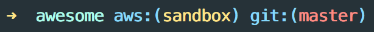

# AWSP - AWS Profile Switcher

Easily switch between AWS Profiles


## Setup

```sh
npm install -g awsp
```

Add the following to your `.bashrc` or `.zshrc` config
```sh
alias awsp="source _awsp"
```

## Usage
```sh
awsp
```

## Recommended Practices

### Default Profiles
Default profiles are not currently supported. This was intentionally done so the user explicitly selects a profile in each shell.

All profiles need to be defined in `~/.aws/config` with the prefix `[profile ...]`

```
[profile sandbox]
```

### Show your AWS Profile in your shell prompt
For better visibility into what your shell is set to it's helpful to configure your prompt to show what value `AWS_PROFILE` your shell is set to.



Here's a sample of my zsh prompt config using oh-my-zsh themes

```sh
function aws_prof {
  local profile="${AWS_PROFILE}"

  if [[ -z "${profile}" ]]
  then echo ""
  else echo "%{$fg_bold[blue]%}aws:(%{$fg[yellow]%}${profile}%{$fg_bold[blue]%})%{$reset_color%} "
  fi
}
```

```sh
PROMPT='OTHER_PROMPT_STUFF $(aws_prof)'
```